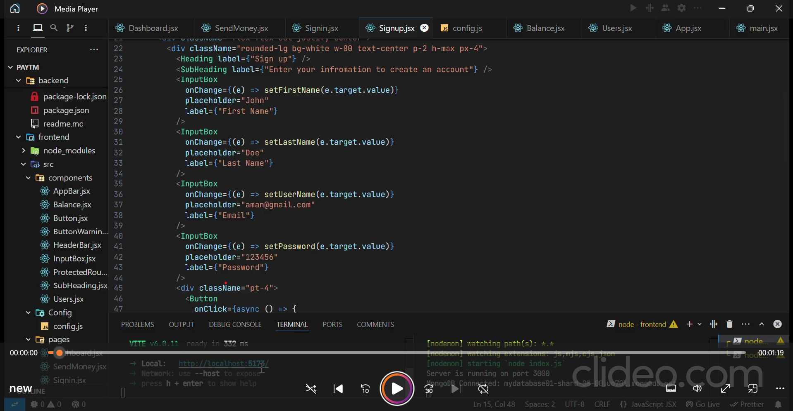

## `Paytm CLone`
- This is a Paytm-like clone built using the MERN stack (MongoDB, Express.js, React.js, and Node.js). The application allows users to sign up, log in, view their account balance, transfer money to other users, and more.

## `Demo 👇`

[](./frontend/src/Assets/new.mp4)

## `Features` 
- User Authentication : Secure user registration and login.
- Account Balance : View current account balance.
- Money Transfer : Transfer money between users.
- Filter Users : Get users based on filter queries.
- Dashboard : View account balance and user list.

## `Backend setup` 
1. Clone the repo: 
```bash 
   git clone https://github.com/Aman-m01/Paytm-clone.git
   cd paytm-clone/backend
```
2. Install dependencies 
```bash 
npm install 
```
3. Set up environment variables: 
- Create a .env file based on the .env.sample file and fill in your MongoDB URI, port, and JWT secret:
```bash
PORT=3000
MONGO_URI=<your_mongodb_connection_string>
JWT_SECRET=<your_jwt_secret_key>
```
4. Start the backend server:
```bash 
npm run dev
```
## `Routes`
### `User Routes (/api/v1/user)`
-  `POST /signup`: 
Sign up a new user.

-  `POST /login`:
Log in an existing user.

-  `PUT /update`:
Update user information (requires authentication).

-  `GET /bulk`:
Get users with filter query.

-  `GET /getuser`:
Get current user information (requires authentication).

---

### `Account Routes (/api/v1/account)`

- `GET /balance`:
Get account balance (requires authentication).

- `POST /transfer`:
Transfer balance to another user (requires authentication).

<br/>

## `Frontend setup` 
1. Navigate to the frontend directory:
```bash 
cd frontend
```
2. Install dependencies 
```bash 
npm install
```
3. Create a .env file based on the .env.sample file and fill in your API URL:
```bash
VITE_API_URL=http://localhost:3000
```
4. Start the frontend Server 
```bash 
npm run dev 
```


## `Pages`
### `Signup(/signup)`


### `Login(/signin)`


### `Transfer Money(/send)`


### `Dashboard(/dashboard)`


## `Happy coding!` 🎉🎉🎉  
